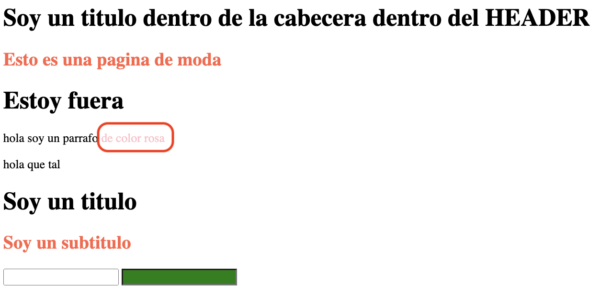
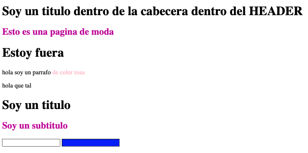

# Selectores Avanzados

## Selectores universales<br/>

Con el selector universal, \* (asterisco) digo que todo sea de un solo color o un estilo en específico

<a href="https://developer.mozilla.org/en-US/docs/Web/CSS/Universal_selectors"> - Recurso Mozilla de selectores universales</a>

<a href="https://www.w3schools.com/cssref/sel_all.asp"> - Recurso CSS \* Selector</a>

## Selectores hijos<br/>

En un header, dentro pongo un título en h1 y dentro un subtitulo h2 "Esto es una pagina de moda". Todos los h1 dentro de un header serán morado:

```css
header h1 {
  color: purple;
}
```

Párrafos, que sean padres del span. En este caso, el p (párrafo) es padre del span:

```css
p > span {
  color: pink;
}
```

<a href="https://developer.mozilla.org/es/docs/Web/CSS/Child_combinator"> - Recurso Mozilla de selectores hijos</a>

<a href="https://developer.mozilla.org/en-US/docs/Web/HTML/Element/span"> - Recurso Mozilla span hijo de paragraph (p)</a>


## Selectores adyacentes<br/>

Una etiqueta que va junta a otra etiqueta:

```css
/* ******** El h2 que vaya después del H1 será verde */
h1 + h2 {
  color: rgb(68, 223, 99);
}
```

<a href="https://developer.mozilla.org/en-US/docs/Web/CSS/Adjacent_sibling_combinatorr"> - Recurso selector adyacente</a>

## Selectores hermanos<br/>

Los h2 que sean hermanos de un h1 llevarán un estilo.

```CSS
/* Los selectores hermanos, el hermano h2 del h1 será del color indicado  */
h1~h2{color:rgb(198, 18, 162);}
```

<a href="https://filisantillan.com/bits/selector-de-hermanos-generales/"> - Recurso selectores hermanos ejemplos</a>

<a href="https://developer.mozilla.org/en-US/docs/Web/CSS/General_sibling_combinator"> - Recurso selectores hermanos</a>

## Selectores de atributo<br/>

Cualquier cosa que sea, como un input

```CSS
input[type="email"]{
    background-color: blue;
}
```



<a href="https://developer.mozilla.org/en-US/docs/Web/CSS/Attribute_selectors"> - Recurso selectores de atributo</a>

<a href="https://developer.mozilla.org/en-US/docs/Web/CSS/General_sibling_combinator"> - Recurso selectores hermanos</a>

```

```
