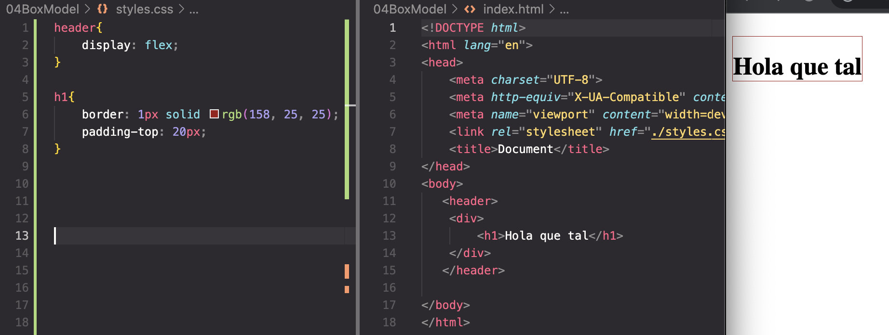
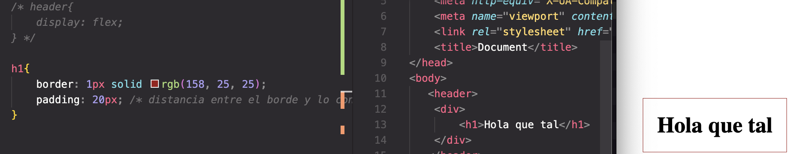
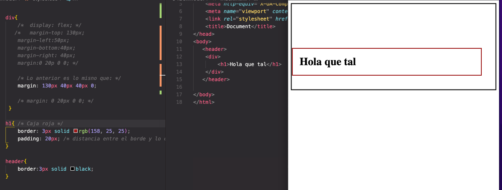

# Box model o Modelo de caja

## Box model 

Con el selector universal, \* (asterisco) digo que todo sea de un solo color o un estilo en específico

Padding: Es la distancia entre el borde y el contenido dentro del borde

Margen: ditancia del borde de un elemento o una caja hacia otro elemento que puede estar contenido o no.

OJO: siempre el parametro comienza por la parte superior, luego el lado derecho, luego abajo y luego del lado izquierdo.

<a href="https://developer.mozilla.org/en-US/docs/Learn/CSS/Building_blocks/The_box_model"> - Recurso Mozilla de box model</a>

<a href="https://www.w3schools.com/css/css_boxmodel.asp"> - Recurso box model</a>

