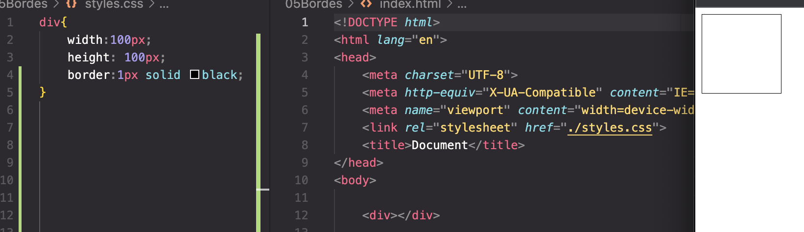
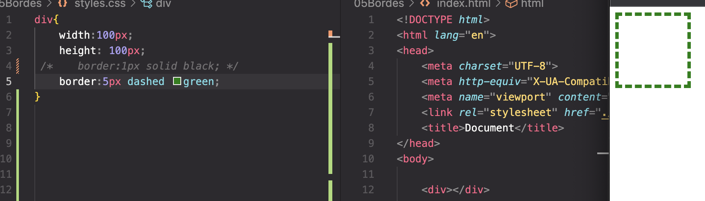
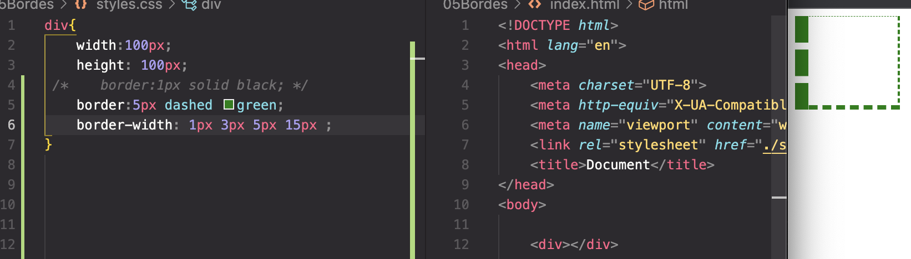

# Bordes

## Bordes 

- Tenemos bordes solidos o dashed, redondos o radius

Creo un div y genero un border

Border punteado o dashed:

Ancho de border:

Border radius (redondo):

<a href="https://www.w3schools.com/css/css_border.asp"> - Recurso borders</a>

<a href="https://developer.mozilla.org/es/docs/Web/CSS/border"> - Recurso Mozilla de borders</a>
