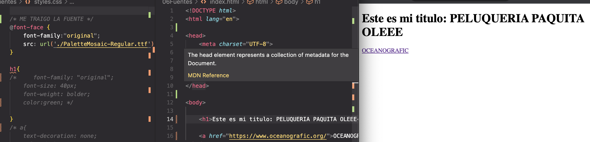
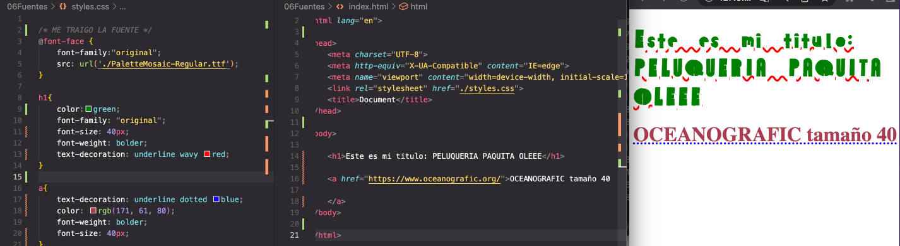

# Fuentes / textos

## Fuentess 

- En "Google fonts" me descargo unas fuentes. bajo una familia de fuentes y me las traigo al tema 06 Fuentes

Importación de las fuentes

Fuentes decoracion:

<a href="https://www.w3schools.com/css/css3_fonts.asp"> - Recurso CSS Web Fonts</a>

<a href="https://www.pagecloud.com/blog/how-to-add-custom-fonts-to-any-website"> - Recurso The Easy Way to Add Fonts to Your Website (Including Custom Fonts)</a>

<a href="https://developer.mozilla.org/en-US/docs/Web/CSS/font-weight"> - Recurso Font weight</a>

<a href="https://developer.mozilla.org/en-US/docs/Web/CSS/text-decoration"> - Recurso Text decoration</a>
