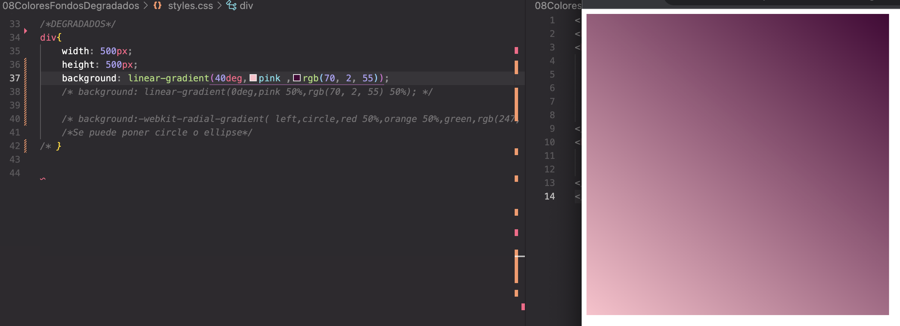

# COLORES

## Representación de los colores en CSS 

Hay 4 maneras diferente de representar los colores en CSS:

- RGB
- RGBA
- HSL
- Hexadecimales

Biblioteca de color como referencia donde hay todo un mundo de paleta de colores para explorar, ver tendencias, o extraer los colores de alguna imagen o foto:
<a href="https://color.adobe.com/create/color-wheel"> - ADOBE COLOR</a>

Biblioteca de patrones de fondo:
<a href="http://patterncooler.com/"> - PATTERN COOLER</a>

## Degradados

<a href="https://developer.mozilla.org/en-US/docs/Web/CSS/CSS_Images/Using_CSS_gradients"> - CSS gradients</a>

Degradados al 50% y 50%:

Degradados:

Degradados top left:

Degradados center circle:

