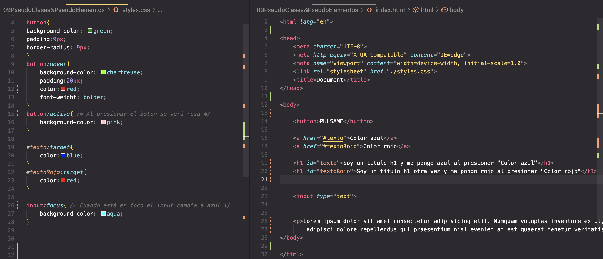
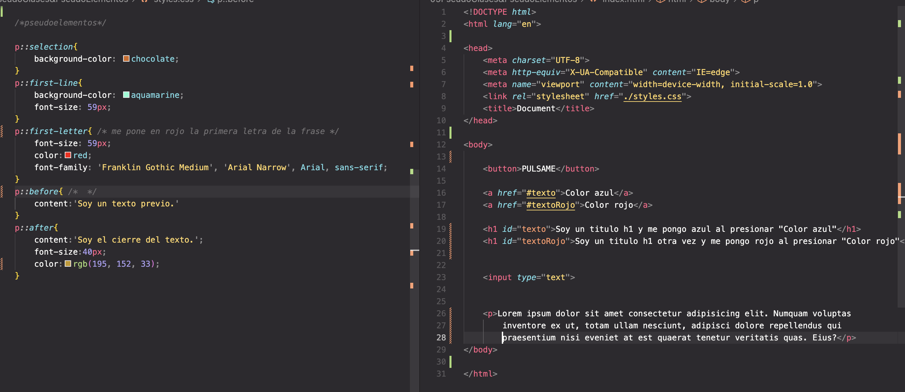

# Pseudoclases y pseudoelementos

Nos sirven para interactuar con el DOM y para añadir texto

## Pseudoclases 

Son muy utilizadas para darle efectos al DOM
<a href="https://developer.mozilla.org/en-US/docs/Web/CSS/Pseudo-classes"> - Recurso Mozilla Pseudoclases</a>

- hover
- active
- target
- focus

Ejemplos:

## Pseudoelementos 

Hace referencia al contenido de los elementos y en nuestro elemento vamos a interactuar con los elementos de un párrafo

<a href="https://developer.mozilla.org/en-US/docs/Web/CSS/Pseudo-elements"> - Recurso Mozilla Pseudo-elementos</a>

- Selection
- first-line
- first - letter
- before
- After

